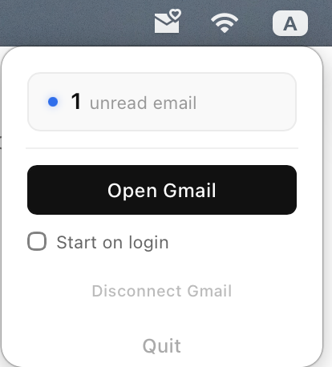

<br>
<p align="center">

</a>
</p>

# 📩 Pulse


A minimalist macOS menubar app for email notifications.



### 🍺 Install with Homebrew

Run the following command:

```bash
brew install yiweishen/tap/pulse
```

### 🛠️ Development

To run the app locally, you need to have [Rust](https://www.rust-lang.org/tools/install) and [Node.js](https://nodejs.org/en/download/) installed. Clone the repository and run:

```bash
npm install
npm run tauri dev
```

### 🚀 Build

To build the app for production, run the following command:

```bash
npm run package
```

### 📦 Release

To release a new version, make sure you don't have any uncommitted changes, and then:

```bash
npm run release
```

### 🔏 OS Sign

You may need to sign the application before running it.

```bash
chmod +x /Applications/Pulse.app && \
xattr -cr /Applications/Pulse.app && \
codesign --force --deep --sign - /Applications/Pulse.app
```

### 🔐 Gmail Setup

Pulse connects to Gmail using OAuth 2.0. You need to create your own Google Cloud OAuth credentials (free).

#### 1. Create a Google Cloud project

1. Go to [Google Cloud Console](https://console.cloud.google.com/) and create a new project (or select an existing one).

#### 2. Enable the Gmail API

1. Go to **APIs & Services → Library**.
2. Search for **Gmail API** and click **Enable**.

#### 3. Create OAuth credentials

1. Go to **APIs & Services → Credentials**.
2. Click **Create Credentials → OAuth client ID**.
3. If prompted, configure the OAuth consent screen first:
   - Choose **OAuth 2.0 Client IDs**, fill in the other details.
   - Add your Google account as a **Test user**.
4. Back in **Create OAuth client ID**:
   - Application type: **Desktop app**
   - Give it any name and click **Create**.
5. Copy the **Client ID** and **Client Secret** shown in the dialog.

#### 4. Connect in Pulse

1. Open Pulse from the menu bar.
2. Paste your **Client ID** and **Client Secret** into the setup fields and click **Save**.
3. Click **Connect Gmail** — a browser window will open.
4. Sign in with your Google account and grant the requested permission.
5. Return to Pulse — your unread count will appear in the menu bar.

### 📌 To Do

- Implement a native window menu using the [Tauri window menu feature](https://v2.tauri.app/learn/window-menu/).
- Extend support to other operating systems, including Windows and Linux, for broader compatibility.
- Integrate support for more email services such as Outlook, Yahoo, and others.
- Allow users to manage and switch between multiple accounts within the app.
- Enable users to create and apply custom configurations for more flexibility.

### ⚠️ Work in Progress

Pulse is an experimental weekend project built to explore Rust and Tauri. As such, it's not production-ready:

- Use at your own risk.
- Expect breaking changes and frequent updates.
